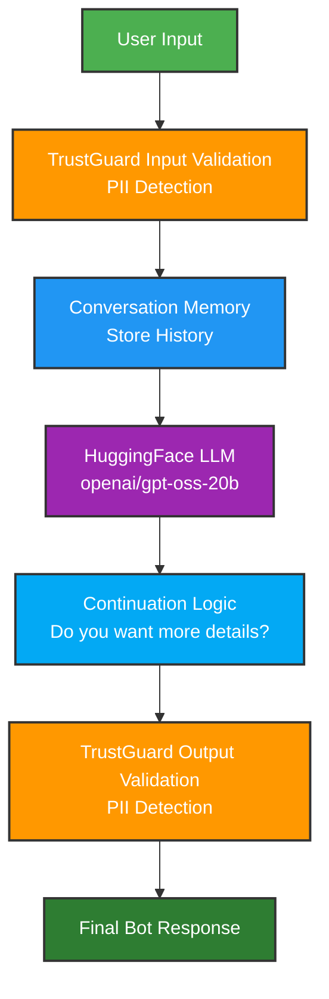

# GenerativeAI-TrustGuard-memory
A safe, context-aware chatbot using Generative AI, TrustGuard PII protection, and built-in memory. Upgradeable to persistent or semantic memory.

Great 👍 Let’s upgrade your README to a **GitHub-portfolio level README** with badges, visuals, and a demo section. This version looks **much more professional to recruiters and collaborators**.

You can copy everything below into **`README.md`**.

---

# 🤖 HuggingFace Chatbot with Memory, Guardrails & Smart Continuation


A **secure conversational AI chatbot** built in Python using a **HuggingFace LLM** with:

* 🧠 conversation memory
* 🔐 PII detection guardrails
* 💬 interactive continuation system
* 🧹 clean response filtering

The assistant asks users if they want **more details before expanding responses**, creating a more natural conversational experience.

---

# 🎥 Demo

Example terminal interaction:

```
🤖 Chatbot with Memory + 'Ask Before Continuing' + PII Detection
(type 'exit' to quit)

You: What is machine learning?

Bot: Machine learning is a branch of artificial intelligence that enables systems
to learn patterns from data and improve automatically.

Do you want more details?

You: yes

Bot: Machine learning includes three main approaches:
1. Supervised learning
2. Unsupervised learning
3. Reinforcement learning
```

---

# ✨ Features

## 🧠 Conversation Memory

Stores the conversation history so responses remain **context-aware**.

```
User: What is AI?
Bot: Artificial intelligence is...

User: Explain more
Bot: AI includes machine learning, NLP...
```

---

## 🔐 PII Detection Guardrails

Using **TrustGuard**, the chatbot detects sensitive information.

Protected data includes:

* phone numbers
* social security numbers
* emails
* personal identifiers

Example:

```
User: My SSN is 123-45-6789
Bot: 🚫 Blocked (PII detected)
```

---

## 💬 Interactive Continuation System

Instead of generating extremely long answers, the bot asks:

> **"Do you want more details?"**

If the user agrees, the assistant continues the explanation.

Accepted responses:

```
yes
y
more
continue
cont
again
keep going
```

---

# 🏗️ Architecture

## Chatbot Processing Pipeline

## Continuation Flow

```
Bot: Explanation...

Bot: Do you want more details?

User: yes
      │
      ▼
Bot prompt → "Please continue from last answer."
      │
      ▼
LLM continues explanation
```

---

# 📦 Installation

## 1️⃣ Clone the repository

```bash
git clone https://github.com/dr-mo-khalaf/GenerativeAI-TrustGuard-memory.git
cd GenerativeAI-TrustGuard-memory

---

## 2️⃣ Install dependencies

```bash
pip install huggingface_hub python-dotenv trustguard
```

---

## 3️⃣ Create environment variables

Create a `.env` file:

```
HF_API_KEY=your_huggingface_token
```

Get your token here:

[https://huggingface.co/settings/tokens](https://huggingface.co/settings/tokens)

---

# 📁 Project Structure

```
chatbot-project/
│
├── chatbot_with_memory_continue.py
│
├── memory.py
│
├── .env
│
└── README.md
```

### File Overview

| File                              | Purpose                     |
| --------------------------------- | --------------------------- |
| `chatbot_with_memory_continue.py` | Main chatbot pipeline       |
| `memory.py`                       | Conversation memory storage |
| `.env`                            | API key configuration       |
| `README.md`                       | Project documentation       |

---

# ▶️ Running the Chatbot

Start the chatbot from the terminal:

```bash
python chatbot_with_memory_continue.py
```

Exit anytime with:

```
exit
```

---

# ⚙️ Configuration

## Memory Size

Limit stored messages:

```python
chat_memory = ChatMemory(max_len=20)
```

---

## Continuation Keywords

Modify accepted responses:

```python
CONTINUE_KEYWORDS = [
"cont",
"continue",
"more",
"keep going",
"again",
"yes",
"y"
]
```

---

## System Prompt

Control chatbot behavior by editing the system prompt:

```
You are a helpful AI assistant.
Answer concisely and naturally.
Do NOT output internal reasoning.
If the answer can be expanded,
end your response with
"Do you want more details?"
```

---

# 🧩 Technologies Used

| Technology      | Purpose               |
| --------------- | --------------------- |
| Python          | Core language         |
| HuggingFace Hub | LLM inference         |
| TrustGuard      | PII detection         |
| python-dotenv   | Environment variables |

---

# 🔮 Future Improvements

Planned upgrades to evolve this chatbot into a **production-style AI assistant**.

### 🧠 Persistent Memory

Store user history across sessions using:

* SQLite
* Redis
* Vector databases

---

### 📚 Retrieval Augmented Generation (RAG)

Allow the chatbot to answer questions using:

* PDFs
* documentation
* company knowledge bases

---

### 🧰 Tool Use (AI Agents)

Enable the assistant to use tools like:

* calculators
* web search
* APIs
* code execution

---

### ⚡ Streaming Responses

Generate answers token-by-token like ChatGPT.

---

# 🤝 Contributing

Contributions are welcome!

1. Fork the repository
2. Create a new branch
3. Submit a pull request

---

# 📄 License

MIT License

---

